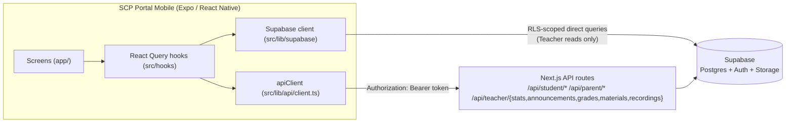
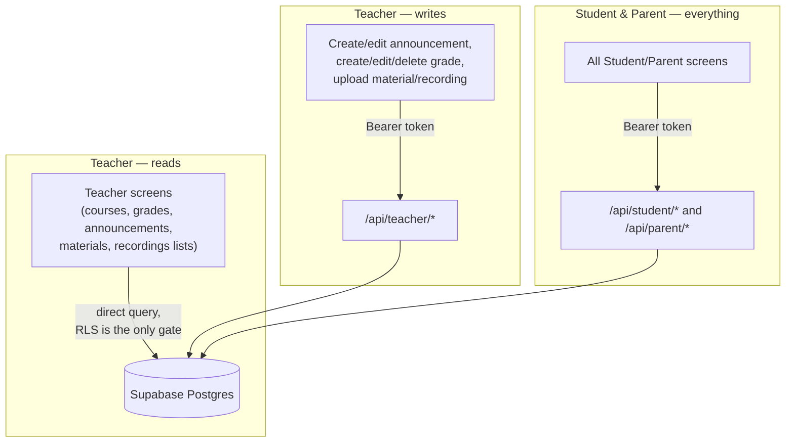
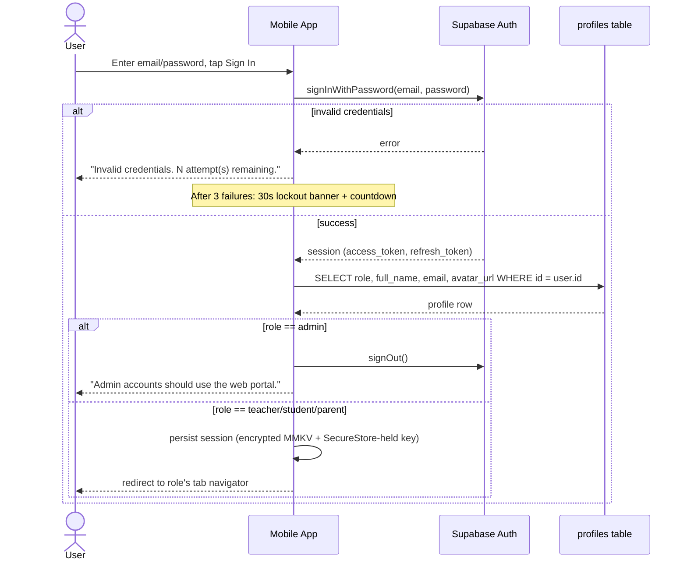
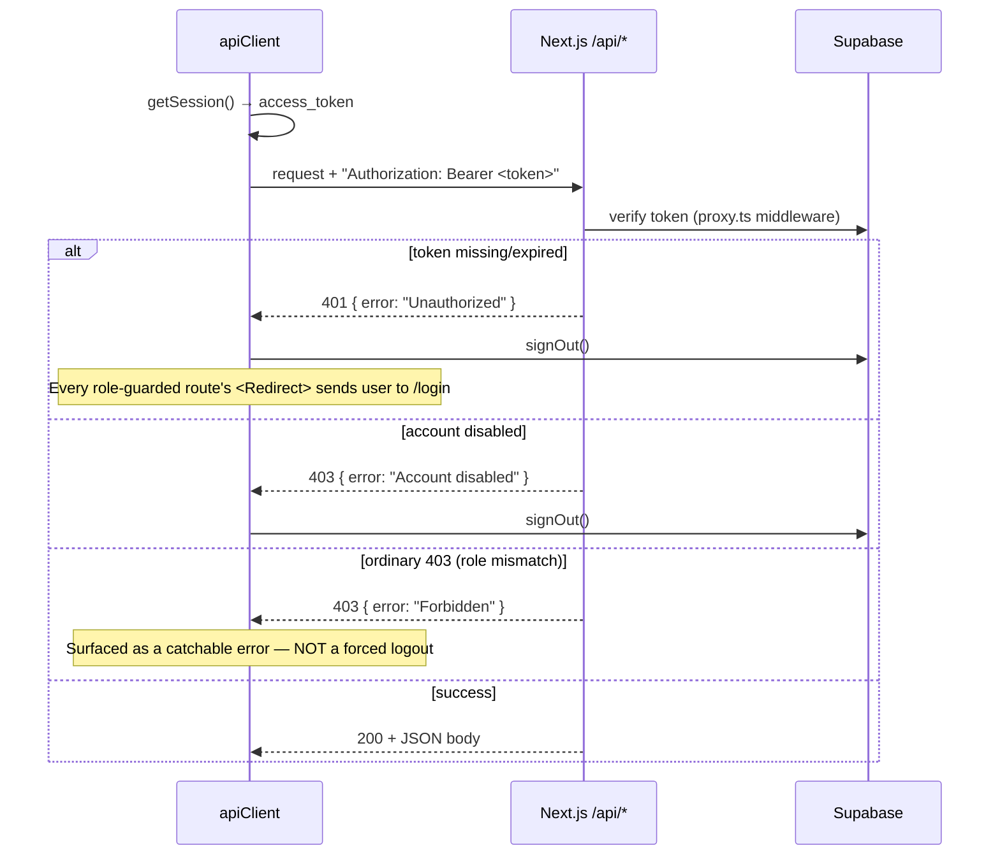
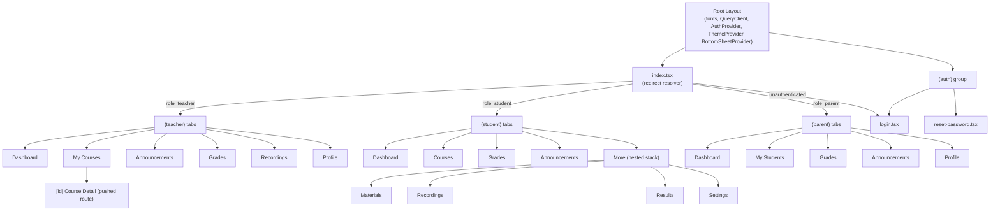
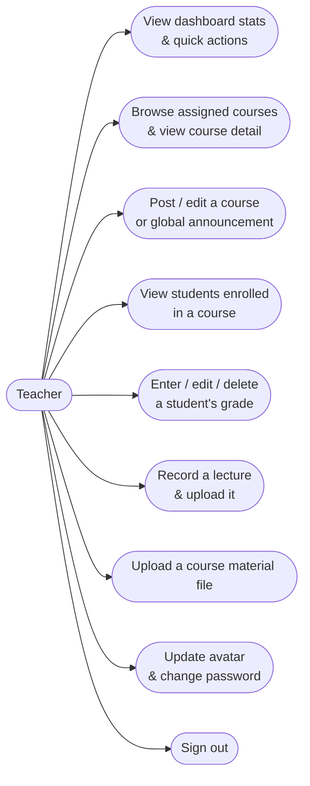
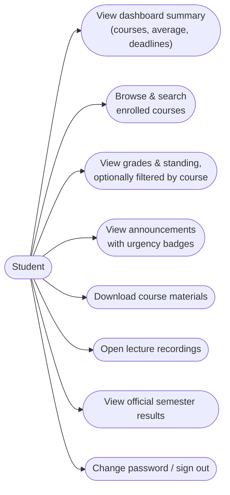
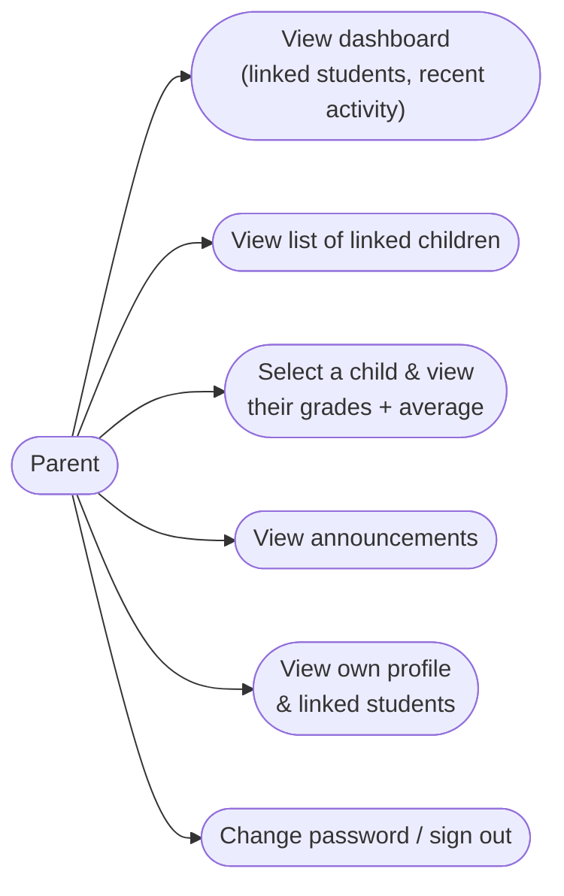
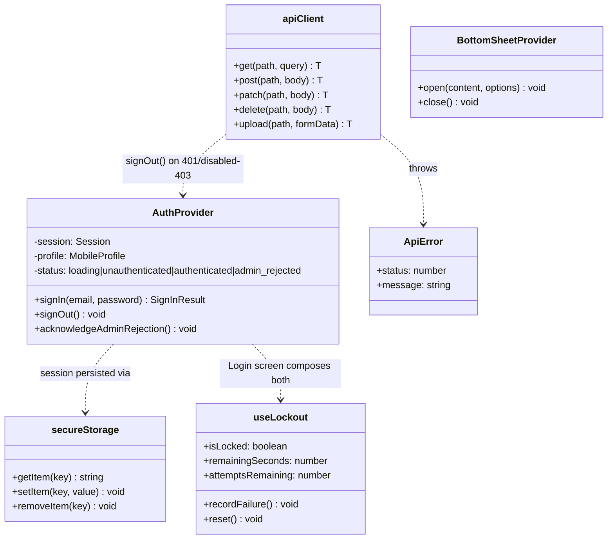
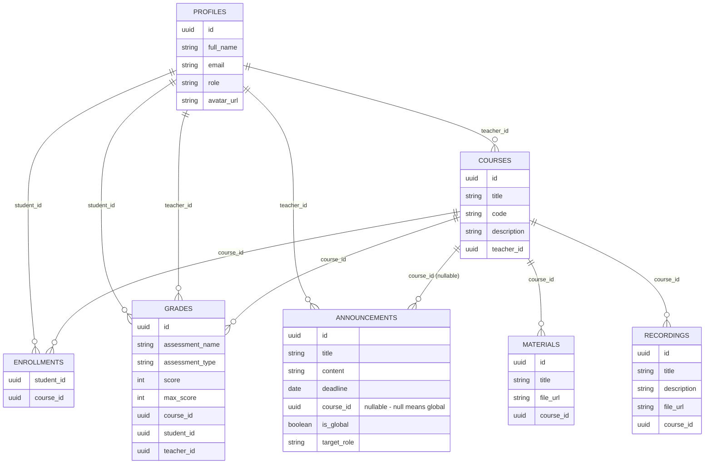

# SCP Portal Mobile — Project Documentation

A complete record of this repository from its creation to its current
state: what was built, why, in what order, and how the pieces fit together.
For testing specifically, see [`testing/README.md`](./testing/README.md).

---

## 1. What this is

**SCP Portal Mobile** is a React Native (Expo) companion app for *SCP
Portal*, an existing School Communication Platform built as a Next.js +
Supabase web app. The web app supports 4 roles (Admin, Teacher, Student,
Parent); the mobile app covers 3 — **Admin stays web-only**. Logging in as
an admin on mobile is explicitly rejected with a message directing the user
to the web portal.

**Stack:** Expo SDK 56, `expo-router` (file-based navigation), Supabase
(`@supabase/supabase-js`) for auth, `@tanstack/react-query` for data
fetching/caching, NativeWind v4 (Tailwind for React Native) for styling
matched to the web app's design system, `@gorhom/bottom-sheet` for modals,
`expo-audio` for lecture recording/playback, `react-native-mmkv` (encrypted)
+ `expo-secure-store` for session storage.

## 2. How this repo came to exist

The repo originally held an unrelated Flutter prototype (`5176760`), which
was removed (`ed7d17e`) to start fresh once the decision was made to build
in React Native/Expo instead. Everything described below was built from an
empty repository (aside from `.git`) over a single continuous session,
organized into one git branch per logical phase, following the project's
existing gitflow convention (`<issue-number>-<short-description>` branch
names, several of which already existed on the remote as empty placeholders
before this work began).

## 3. Build timeline (phase → branch → what shipped)

| # | Branch | What shipped |
|---|---|---|
| 0 | `setup-expo-mobile-project` | Expo scaffold, NativeWind, Google Fonts (Geist, Geist Mono, Playfair Display, DM Sans), design tokens (color scales, per-role themes, avatar gradients) |
| 1 | `build-login-screen` | Supabase auth (`AuthProvider`), encrypted MMKV+SecureStore session storage, Login + Reset Password screens, 3-fail lockout, admin rejection, per-role route guards — **merged to `develop` via PR #10** |
| 2 | `2-configure-api-connection` | Typed `apiClient` (Bearer token attachment, `{error}` normalization, 401 auto-logout), React Query wiring, shared change-password/avatar-upload |
| 3 | `3-shared-ui-and-tab-navigation` | Shared component library (StatCard, HeroBanner, Badge, ScoreBadge, AvatarCircle, EmptyState, buttons), bottom-sheet system, `ThemeProvider` (per-role colors via NativeWind CSS vars), all 3 bottom-tab navigators |
| 4 | `5-build-student-dashboard` | All 8 Student screens wired to real endpoints |
| 5 | `6-build-teacher-dashboard` | All 7 Teacher screens — **reads via direct Supabase queries, writes via the API** (architecture detail in §5) |
| 6 | `build-parent-dashboard` | All 5 Parent screens wired to `/api/parent/*` |
| 7 | `7-file-uploads` | Material file upload (`expo-document-picker`, type/size validation) |
| 8 | `8-audio-recording` | Lecture recording (`expo-audio`), embedded audio playback |
| 9 | `9-polish-pass` | Loading-state fix (8 screens), backend-changelog response (disabled accounts, grade shape, recording MIME format), defensive null-guards across Teacher/Parent after live-data testing surfaced 2 real crash bugs, EAS Build setup |
| 11 | `11-testing-infrastructure` | Jest unit tests (37 tests), QA test cases, UAT scenarios, load-test script, security review |

Each phase was verified with `tsc --noEmit`, `expo export` (bundle build),
and `expo-doctor` before moving to the next — all clean throughout. Phase
10 doesn't exist as a separate branch; the backend-changelog/crash-bug
fixes landed on `9-polish-pass` directly.

## 4. High-level architecture

## 5. The hybrid data-access architecture (Teacher vs Student/Parent)

This is the single most important architectural fact about this codebase,
discovered mid-build (not in the original spec) and confirmed with the
backend team: **Student and Parent go through API routes for everything.
Teacher reads go straight to Supabase; only Teacher writes go through the
API.**

**Why:** the backend's `GET /api/teacher/*` list routes simply don't exist
— only `GET /teacher/stats` and the mutation routes are real API endpoints.
This mirrors the web app's own code, where Teacher pages always queried
Supabase directly and never went through the API-route rewrite that
Student/Parent got. **Consequence:** Teacher-read correctness depends
entirely on Supabase RLS policies being correct on `courses`, `materials`,
`recordings`, and `announcements` — and as of this writing, the backend
team had only confirmed/fixed RLS on `grades`, leaving those four
unaudited. This is a real, open risk tracked in §9.

## 6. Authentication flow

Session persistence detail: Supabase session JSON routinely exceeds
`expo-secure-store`'s safe per-item size (~2KB), so the session itself is
stored in **encrypted MMKV**, with SecureStore holding only the small
random encryption key — neither piece is useful without the other.

## 7. API request lifecycle (Bearer auth, 401/403 handling)

This exact logic is what's covered by the `apiClient` unit tests (see
`src/lib/api/__tests__/client.test.ts`) — including the important
distinction that a disabled-account 403 forces logout but an ordinary
role-mismatch 403 does not.

## 8. Navigation structure

Rule of thumb used throughout: any row-tap detail that isn't its own
spec'd screen opens a **bottom sheet** (announcement detail, a student's
grades within a course, a child's detail) instead of a pushed route. Only
Teacher's Course Detail is a real route, since the spec calls it out as a
distinct screen.

## 9. Use case diagrams

### Teacher

### Student

### Parent

## 10. Core module structure (class diagram)

## 11. Data model (as confirmed against the live API, not just the spec)

**Important, hard-won detail:** `ANNOUNCEMENTS.course_id` is nullable
(global announcements), and the joined `courses` object can come back
`null` even on endpoints the original spec didn't flag as nullable. This
was discovered by testing the live API with a real account mid-build (see
§13) and is now defensively guarded everywhere across Student, Teacher, and
Parent screens.

## 12. Screens inventory

| Role | Screens |
|---|---|
| Auth | Login, Reset Password |
| Teacher (7) | Dashboard, My Courses, Course Detail, Announcements, Grades, Recordings, Profile |
| Student (8) | Dashboard, Courses, Grades, Announcements, More→Materials, More→Recordings, More→Results, More→Settings |
| Parent (5) | Dashboard, My Students, Grades, Announcements, Profile |

## 13. Real-world verification, not just static checks

Every phase passed `tsc --noEmit`, `expo export`, and `expo-doctor` — but
those only prove the code *compiles*. Three things made this build
meaningfully more trustworthy than "it builds":

1. **A real backend bug was found and reported, not assumed.** Early on,
   the backend's `proxy.ts` middleware only recognized browser cookies,
   silently rejecting every mobile request before the Bearer-token logic
   in `requireAuth()` ever ran — confirmed by logging in for real and
   sending a valid token to the live API, which came back `401` until the
   fix was deployed.
2. **Two real crash bugs were found via live data, not code review.**
   Once the backend fix was live, logging in with a real student account
   and hitting the real `/student/dashboard` and `/student/announcements`
   endpoints surfaced response shapes the original spec didn't document
   (`courses: null` for global announcements; the dashboard's embedded
   grades missing fields the dedicated endpoint has). Both were fixed and
   re-verified against the live API; the same risk class was then
   defensively guarded across Teacher and Parent screens even without
   live credentials to reproduce it there.
3. **A real recording-format bug was caught before any user hit it.**
   `expo-audio`'s default recording preset produces `.m4a` (`audio/mp4`),
   which was never in the backend's accepted upload list
   (`audio/webm`/`mpeg`/`wav`/`ogg`) — every recording upload would have
   silently failed. Replaced with a custom config (WAV via Linear PCM on
   iOS; webm on Android, flagged as unverified without a physical device).

## 14. Known open risks (as of this writing)

- **Teacher RLS unaudited** on `courses`, `materials`, `recordings`,
  `announcements` (only `grades` confirmed fixed by the backend team) — see
  §5.
- **Parent `student_id` authorization** on `/api/parent/grades` not yet
  confirmed server-side (a parent could request a `student_id` that isn't
  their own child; whether the backend rejects it is unverified).
- **Android recording format unverified on a physical device** (§13.3).
- **Teacher and Parent flows have not been tested with a real login**, only
  defensively hardened against the failure pattern found in Student.
- No screen has been visually confirmed on a device by a human yet.

## 15. Where to go next

See [`testing/README.md`](./testing/README.md) for the full testing
strategy (unit tests, QA test cases, UAT scenarios, load testing, security
review) and exactly how/where to run each one.
